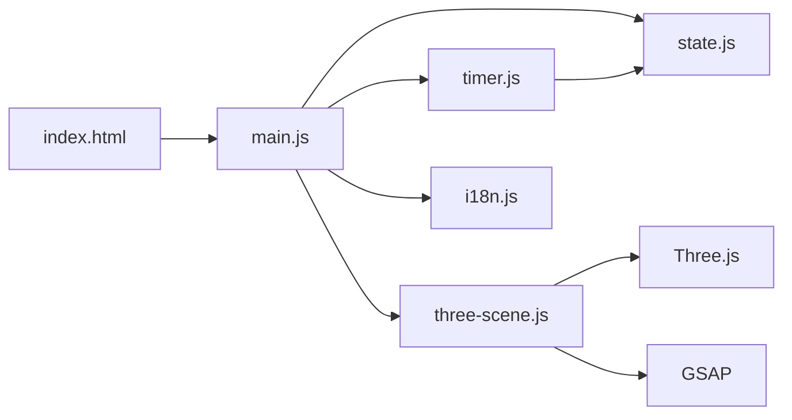

# 🍅 Tomato — Focus Ritual Tool

> A pixel-art media-art focus ritual application with 3D WebGL stage, built with Vite + Three.js + GSAP.  
> Not a productivity dashboard. A digital ritual stage.


**[한국어 버전은 아래에 있습니다 ↓](#-tomato--포커스-리추얼-툴)**

---

## Concept

Tomato is a **Focus Ritual Tool** — not a standard Pomodoro timer.

Focus is not a task to manage but a **ritual to enter**. The visual language draws from pixel-art media installations, digital sculpture, and tactical signal aesthetics. Each session is a **stage performance** — beginning → signal lock → tension sequence → ceremonial completion.

---

## Features

| Feature | Description |
|---|---|
| **5-View Navigation** | HOME · PLAN · FOCUS · ARCHIVE · NEW via bottom tab bar |
| **3D Background Stage** | Three.js pixelated monolith + horizon grid + particle rain, reactive to app state |
| **Split-Pane Planner** | Monthly calendar (left) + planning console (right) with drag scheduling |
| **Pomodoro Timer** | Date.now()-precision countdown with focus/break cycles and long break every 4 blocks |
| **AI Task Subdivision** | Intelligent task decomposition into phased focus blocks |
| **Archive Memory Vault** | Completed rituals become collectible stamp cards with signal intensity metrics |
| **Ritual Detail Sheet** | Full session report with re-execute and planner cross-reference |
| **i18n (EN / KO)** | Full bilingual support with live toggle |
| **PWA** | Offline-capable via Service Worker with installable manifest |
| **Browser Notifications** | Focus/break completion alerts |
| **Day Rollover** | Auto-detects date change, marks incomplete tasks as missed |

---

## Design Language

| Principle | Description |
|---|---|
| **Night × Imperial** | Deep black base (`#000F08`) with Imperial Red (`#FB3640`) as the singular reactive signal |
| **Pixel-Art Media Art** | Low-resolution digital sculpture stage, not retro game aesthetics |
| **Behavioral UX** | Every screen drives one action. Empty states invite, not just wait |
| **Signal-Driven Motion** | Animation is slow, geometric, state-controlled — never decorative |

### Color System

| Token | Hex | Role |
|---|---|---|
| Deep Base | `#000F08` | Scene background, void |
| Stage Black | `#050505` | Monolith core, surfaces |
| Surface Black | `#0F0F0F` | Cards, panels |
| Hero Red | `#FB3640` | Signal event — active state, armed slot, tension |
| Break Green | `#2ECC71` | Rest cycle indicator |
| Soft White | `#F4F1EA` | Typography, wireframe glints |

### Typography

| Font | Usage |
|---|---|
| `Silkscreen` | EN/NUM display — section headers, clock digits |
| `Galmuri11/14` | KO pixel font — Korean UI text |
| `JetBrains Mono` | Metadata, timestamps, monospaced copy |

---

## Architecture

```
Tomato/
├── index.html              # App shell — 5-view SPA with all semantic sections
├── package.json            # Vite 8 + Three.js 0.183 + GSAP 3.14
│
├── src/
│   ├── main.js             # View router, render engine, all interactions (1,387 lines)
│   ├── state.js            # Single source of truth, localStorage persistence (113 lines)
│   ├── timer.js            # Date.now()-accurate countdown engine (90 lines)
│   ├── three-scene.js      # 3D pixel media art background stage (253 lines)
│   ├── i18n.js             # EN/KO dictionary (269 lines)
│   └── style.css           # Full design system — CSS custom properties (1,644 lines)
│
├── public/
│   ├── manifest.json       # PWA manifest
│   └── sw.js               # Service Worker (network-first with cache fallback)
│
└── ref/                    # Design reference files (not used in production)
    ├── app.jsx             # Original React prototype reference
    ├── stage.js            # 3D stage reference
    ├── styles.css          # Style reference
    └── Tomato.html         # Original HTML reference
```

### Module Dependency Graph



---

## 5-View System

### `HOME` — Action Stage
- Hero card with tonight's main focus task, next-up preview, and pentagon SVG overlay
- Signal bar showing pomodoro block progress (e.g. `2/4 BLOCKS`)
- Full-size pixel clock with state-based styling (echo/heavy)
- Right column panels: **Focus Slots // Today**, **Signal Stats** (today/week/streak/total), **Recent Rituals** strip
- CTA: `[ BEGIN RITUAL ]` + `[ OPEN PLANNER ]`

### `PLAN` — Split-Pane Calendar Planner
- **Left pane**: Monthly grid calendar with task indicators, today highlight, and date selection
- **Right pane**: Planning console with selected date display, scheduled task list, unscheduled queue, task detail card, and AI plan output
- Double-click any calendar cell to create a new task
- AI plan apply/regenerate workflow

### `FOCUS` — Ritual Timer
- Fullscreen pixel clock with `Silkscreen` font
- Rotating pentagon SVG overlay that accelerates as time decreases
- Three intensity phases: normal → `phase-warm` (< 50%) → `phase-tension` (< 25%)
- Progress timeline bar with 5-minute tick marks
- Linked task display and status copy: `SIGNAL LOCKED // IN PROGRESS`
- Controls: `[ PAUSE ]` / `[ COMPLETE LOOP ]`

### `BREAK` — Rest Cycle
- Green-tinted break timer (5 min standard / 15 min after every 4th block)
- 3D monolith freezes and wireframe turns green
- `[ SKIP REST ]` option

### `ARCHIVE` — Ritual Collection
- Statistics header: total rituals, today count, streak, total focus minutes
- Filter chips: `[ ALL ]` / `[ 25M ]` / `[ 50M+ ]` / `[ STREAK ]`
- Date-grouped ritual cards with shape codes (`■` `▲` `●` `◆`), color-coded by duration
- Click any card → opens **Ritual Detail Sheet** with signal intensity bar, metadata, and re-execute action

---

## 3D Background Stage

The background is a **pixel-constructed media art environment** using Three.js with `RenderPixelatedPass` (pixel size 6).

| Layer | Description |
|---|---|
| **Horizon Grid** | `GridHelper` lattice that slowly tracks forward, creating digital spatial depth |
| **Pixel Monolith** | Low-poly `IcosahedronGeometry` — dark solid core + brutalist wireframe cage + inner red signal mesh |
| **Symbolic Particles** | 150 grid-snapped `+` symbols (canvas-drawn, `NearestFilter`), drifting downward like signal rain |

### Per-View State Reactions

| View | 3D Behavior |
|---|---|
| HOME | Monolith centered, wireframe dim gray, slow rotation, mouse parallax active |
| FOCUS | Wireframe turns red, scale 1.2×, red inner pulse activates, parallax disabled |
| BREAK | Monolith freezes, wireframe goes green, scale shrinks to 0.8× |
| PLAN | Monolith retreats (y: -2, z: -5), scale 0.6×, wireframe near-invisible |
| ARCHIVE | Monolith nearly gone (scale 0.1), only grid horizon remains |

### Per-View Atmosphere Intensity

| View | Stage Opacity | Scanlines | Grain |
|---|---|---|---|
| HOME | 0.70 | 0.85 | 0.30 |
| FOCUS | 1.00 | 1.20 | 0.40 |
| BREAK | 0.55 | 0.60 | 0.25 |
| PLAN | 0.40 | 0.60 | 0.20 |
| ARCHIVE | 0.32 | 0.55 | 0.22 |

---

## Data Flow

```js
appState.tasks    // [ { id, title, focusMinutes, breakMinutes, status, timeLabel, targetDate, order } ]
appState.history  // [ { ...task, completedAt, date, sequence, systemNote } ]
appState.session  // { activeTaskId, mode, remainingSeconds, isRunning, pomodoroCount, pomodoroGoal, ... }
appState.aiTasks  // [ ...proposed AI tasks ]
appState.prefs    // { lang: 'en' | 'ko' }
```

### Ritual Lifecycle

```
[OPEN] → user clicks BEGIN → [ACTIVE] → timer runs → timer end / COMPLETE LOOP
   → task marked [DONE] → history entry created → pomodoroCount++ → BREAK mode
   → break timer → BREAK end → back to HOME → next ritual
```

### Persistence (localStorage)

| Key | Content |
|---|---|
| `tomato_os_tasks` | Task array |
| `tomato_os_history` | Completed ritual history |
| `tomato_os_session` | Session state (pomodoro count, calendar offset, selected date) |
| `tomato_lang` | Language preference |

---

## Tech Stack

| Library | Version | Role |
|---|---|---|
| [Vite](https://vite.dev) | ^8.0 | Dev server + ES module bundler |
| [Three.js](https://threejs.org) | ^0.183 | WebGL 3D background stage |
| `RenderPixelatedPass` | Three.js addon | Pixel post-processing shader |
| [GSAP](https://gsap.com) | ^3.14 | State-driven animation & camera transitions |
| Google Fonts | — | Silkscreen, JetBrains Mono, Inter |
| Galmuri | CDN | Korean pixel font family |

---

## Development

```bash
# Install dependencies
npm install

# Start dev server (http://localhost:5173)
npm run dev

# Build for production
npm run build

# Preview production build
npm run preview
```

> **Troubleshooting**: If the UI appears broken, open DevTools → Application → Local Storage → delete all `tomato_os_*` keys, then refresh. This clears stale data from older versions.

---

## Version History

| Version | Highlights |
|---|---|
| V11 | Bottom tab bar navigation, meta bar with sector label, per-view atmosphere system |
| V9 | Split-pane planner, AI planning flow, archive memory vault |
| V8 | Monthly grid calendar, Korean pixel font (NeoDunggeunmo → Galmuri) |
| V7 | Calendar planner view, i18n (EN/KO), quick edit D&D |
| V6 | Pomodoro core completion, scheduling system, archive deep-dive |
| V5 | Pixel-art media ritual tool identity established |
| V2 | Brutalist kinetic UI overhaul |
| V1 | 3D glass tomato, layered SPA, AI task slicing |

---

## Philosophy

> "Each screen drives one action.  
> The background breathes, not decorates.  
> Focus is not tracked. Focus is performed."

*Imperial Red is a signal event only. Never use it as a base fill.*

---
---

# 🍅 Tomato — 포커스 리추얼 툴

> Vite + Three.js + GSAP 기반 픽셀 미디어아트 집중 리추얼 웹 앱입니다.  
> 생산성 대시보드가 아닙니다. 디지털 제단(Ritual Stage)입니다.


---

## 컨셉

Tomato는 **포커스 리추얼 툴**입니다 — 일반적인 포모도로 타이머가 아닙니다.

집중은 관리하는 것이 아니라 **입장하는 의식(Ritual)**입니다. 비주얼 언어는 픽셀 미디어 아트 설치물, 디지털 조각, 전술적 신호 미학에서 가져왔습니다. 각 세션은 시작 → 신호 잠금 → 긴장 구간 → 완료 의식으로 이어지는 **스테이지 퍼포먼스**입니다.

---

## 주요 기능

| 기능 | 설명 |
|---|---|
| **5뷰 네비게이션** | HOME · PLAN · FOCUS · ARCHIVE · NEW (하단 탭바) |
| **3D 배경 스테이지** | Three.js 픽셀화된 모놀리스 + 수평선 그리드 + 파티클 레인 (앱 상태에 반응) |
| **분할 패널 플래너** | 월간 캘린더(좌) + 플래닝 콘솔(우) |
| **포모도로 타이머** | Date.now() 기반 정밀 카운트다운, 집중/휴식 사이클, 4블록마다 장기 휴식 |
| **AI 작업 분할** | 작업을 단계별 집중 블록으로 지능적 분해 |
| **아카이브 메모리 볼트** | 완료된 리추얼이 수집형 스탬프 카드로 변환, 신호 강도 지표 포함 |
| **리추얼 상세 시트** | 세션 리포트 + 재실행 + 플래너 교차 참조 |
| **다국어 (EN / KO)** | 실시간 토글 전환 |
| **PWA** | Service Worker 기반 오프라인 지원 |
| **브라우저 알림** | 집중/휴식 완료 알림 |
| **일자 자동 전환** | 날짜 변경 감지, 미완료 작업 자동 missed 처리 |

---

## 디자인 언어

| 원칙 | 설명 |
|---|---|
| **Night × Imperial** | 깊은 블랙 베이스(`#000F08`) 위에 임페리얼 레드(`#FB3640`)를 유일한 반응형 신호로 사용 |
| **픽셀 미디어 아트** | 레트로 게임 미학이 아닌 — 저해상도 디지털 조각 스테이지 |
| **행동 유도 UX** | 모든 화면은 하나의 행동을 이끕니다. 빈 공간도 초대합니다. |
| **신호 기반 모션** | 애니메이션은 느리고, 기하학적이며, 상태에 의해 제어됩니다. |

### 컬러 시스템

| 토큰 | 헥스 | 역할 |
|---|---|---|
| Deep Base | `#000F08` | 씬 배경, 심연 |
| Stage Black | `#050505` | 모놀리스 코어, 표면 |
| Surface Black | `#0F0F0F` | 카드, 패널 |
| Hero Red | `#FB3640` | 신호 이벤트 전용 — 활성 상태, 긴장 구간 |
| Break Green | `#2ECC71` | 휴식 사이클 표시 |
| Soft White | `#F4F1EA` | 타이포그래피, 와이어프레임 반짝임 |

### 타이포그래피

| 폰트 | 사용처 |
|---|---|
| `Silkscreen` | EN/숫자 디스플레이 — 섹션 헤더, 시계 숫자 |
| `Galmuri11/14` | 한국어 픽셀 폰트 — 한글 UI 텍스트 |
| `JetBrains Mono` | 메타데이터, 타임스탬프, 모노스페이스 카피 |

---

## 아키텍처

```
Tomato/
├── index.html              # 앱 셸 — 5개 뷰 SPA
├── package.json            # Vite 8 + Three.js 0.183 + GSAP 3.14
│
├── src/
│   ├── main.js             # 뷰 라우터, 렌더 엔진, 모든 상호작용 (1,387줄)
│   ├── state.js            # 단일 진실 공급원, localStorage 영속성 (113줄)
│   ├── timer.js            # Date.now() 기반 카운트다운 엔진 (90줄)
│   ├── three-scene.js      # 3D 픽셀 미디어아트 배경 스테이지 (253줄)
│   ├── i18n.js             # EN/KO 사전 (269줄)
│   └── style.css           # 전체 디자인 시스템 — CSS 커스텀 프로퍼티 (1,644줄)
│
├── public/
│   ├── manifest.json       # PWA 매니페스트
│   └── sw.js               # Service Worker
│
└── ref/                    # 디자인 레퍼런스 파일 (프로덕션 미사용)
```

---

## 5가지 뷰 시스템

### `HOME` — 액션 스테이지
- 히어로 카드에 오늘의 주요 집중 작업, 다음 작업 미리보기, 오각형 SVG 오버레이
- 신호 바로 포모도로 블록 진행률 표시 (예: `2/4 BLOCKS`)
- 우측 패널: **포커스 슬롯**, **신호 통계** (오늘/주간/연속/총합), **최근 리추얼** 스트립
- CTA: `[ BEGIN RITUAL ]` + `[ OPEN PLANNER ]`

### `PLAN` — 분할 패널 캘린더 플래너
- **좌측**: 월간 그리드 캘린더 (작업 표시기, 오늘 하이라이트, 날짜 선택)
- **우측**: 플래닝 콘솔 (배정/미배정 작업 목록, 작업 상세, AI 계획 출력)
- 셀 더블클릭으로 새 작업 생성

### `FOCUS` — 리추얼 타이머
- 풀스크린 픽셀 시계 (`Silkscreen` 폰트)
- 회전하는 오각형 SVG (시간 감소에 따라 가속)
- 3단계 강도: 일반 → `phase-warm` (< 50%) → `phase-tension` (< 25%)
- 진행 타임라인 바 + 5분 단위 눈금
- 버튼: `[ PAUSE ]` / `[ COMPLETE LOOP ]`

### `BREAK` — 휴식 사이클
- 녹색 톤 휴식 타이머 (기본 5분 / 4번째 블록 이후 15분)
- 3D 모놀리스 정지 + 와이어프레임 녹색 전환

### `ARCHIVE` — 리추얼 수집함
- 통계 헤더 + 필터 칩: `[ 전체 ]` / `[ 25분 ]` / `[ 50분+ ]` / `[ 연속 ]`
- 날짜별 그룹 리추얼 카드 (도형 코드 + 시간별 색상 구분)
- 카드 클릭 → **리추얼 상세 시트** (신호 강도 바, 메타데이터, 재실행)

---

## 3D 배경 스테이지

Three.js `RenderPixelatedPass` (픽셀 사이즈 6) 기반 **픽셀 미디어아트 환경**입니다.

| 레이어 | 설명 |
|---|---|
| **수평선 그리드** | `GridHelper` 격자가 느리게 전진, 디지털 공간 깊이감 생성 |
| **픽셀 모놀리스** | 저폴리 `IcosahedronGeometry` — 솔리드 코어 + 와이어프레임 케이지 + 내부 레드 신호 메쉬 |
| **심볼릭 파티클** | 격자 스냅 150개 `+` 심볼 파티클, 신호 비처럼 하강 |

### 뷰별 스테이지 반응

| 뷰 | 동작 |
|---|---|
| HOME | 모놀리스 중앙, 희미한 회색 와이어프레임, 느린 회전, 마우스 패럴랙스 |
| FOCUS | 와이어프레임 레드, 스케일 1.2×, 내부 레드 펄스 활성화 |
| BREAK | 모놀리스 정지, 와이어프레임 녹색, 스케일 0.8× |
| PLAN | 모놀리스 후퇴 (y:-2, z:-5), 스케일 0.6× |
| ARCHIVE | 모놀리스 거의 사라짐 (스케일 0.1) |

---

## 데이터 플로우

```js
appState.tasks    // [ { id, title, focusMinutes, breakMinutes, status, timeLabel, targetDate, order } ]
appState.history  // [ { ...task, completedAt, date, sequence, systemNote } ]
appState.session  // { activeTaskId, mode, remainingSeconds, isRunning, pomodoroCount, ... }
appState.aiTasks  // AI 제안 작업 배열
appState.prefs    // { lang: 'en' | 'ko' }
```

### 리추얼 라이프사이클

```
[OPEN] → BEGIN 클릭 → [ACTIVE] → 타이머 → 완료 → [DONE]
   → history 기록 → pomodoroCount++ → BREAK 모드 → 휴식 종료 → HOME 복귀
```

### 영속성 (localStorage)

| 키 | 내용 |
|---|---|
| `tomato_os_tasks` | 작업 배열 |
| `tomato_os_history` | 완료된 리추얼 이력 |
| `tomato_os_session` | 세션 상태 |
| `tomato_lang` | 언어 설정 |

---

## 기술 스택

| 라이브러리 | 버전 | 역할 |
|---|---|---|
| [Vite](https://vite.dev) | ^8.0 | 개발 서버 + ES 모듈 번들러 |
| [Three.js](https://threejs.org) | ^0.183 | WebGL 3D 배경 스테이지 |
| `RenderPixelatedPass` | Three.js 애드온 | 픽셀 포스트프로세싱 셰이더 |
| [GSAP](https://gsap.com) | ^3.14 | 상태 기반 애니메이션 |
| Google Fonts | — | Silkscreen, JetBrains Mono, Inter |
| Galmuri | CDN | 한국어 픽셀 폰트 패밀리 |

---

## 개발 시작

```bash
# 의존성 설치
npm install

# 개발 서버 시작 (http://localhost:5173)
npm run dev

# 프로덕션 빌드
npm run build
```

> **문제 해결**: UI가 깨져보이면, 개발자 도구 → Application → Local Storage에서 `tomato_os_*` 키를 모두 삭제 후 새로고침 하세요.

---

## 버전 이력

| 버전 | 주요 변경 |
|---|---|
| V11 | 하단 탭바 내비게이션, 메타바 섹터 레이블, 뷰별 분위기 시스템 |
| V9 | 분할 패널 플래너, AI 플래닝 플로우, 아카이브 메모리 볼트 |
| V8 | 월간 그리드 캘린더, 한글 픽셀 폰트 전역 적용 |
| V7 | 캘린더형 플래너 뷰, 다국어 지원 (EN/KO) |
| V6 | 포모도로 코어 완성, 일정관리 시스템, 아카이브 심화 |
| V5 | 픽셀아트 미디어 리추얼 툴 정체성 확립 |
| V1 | 3D 유리 토마토, 레이어드 SPA, AI 태스크 슬라이싱 |

---

## 프로젝트 철학

> "각 화면은 하나의 행동을 이끕니다.  
> 배경은 숨쉬되, 장식하지 않습니다.  
> 집중은 기록되지 않습니다. 집중은 수행됩니다."

*임페리얼 레드는 신호 이벤트로만 써야 합니다. 기본 채움(Base fill)으로 사용하지 마세요.*
