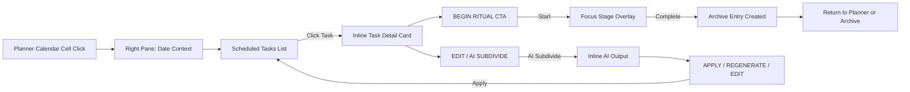
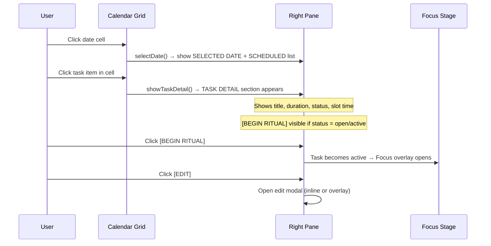
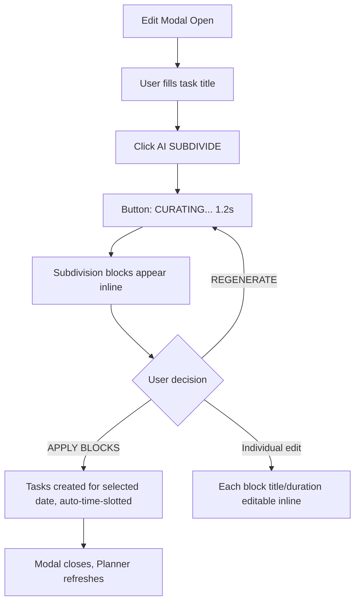
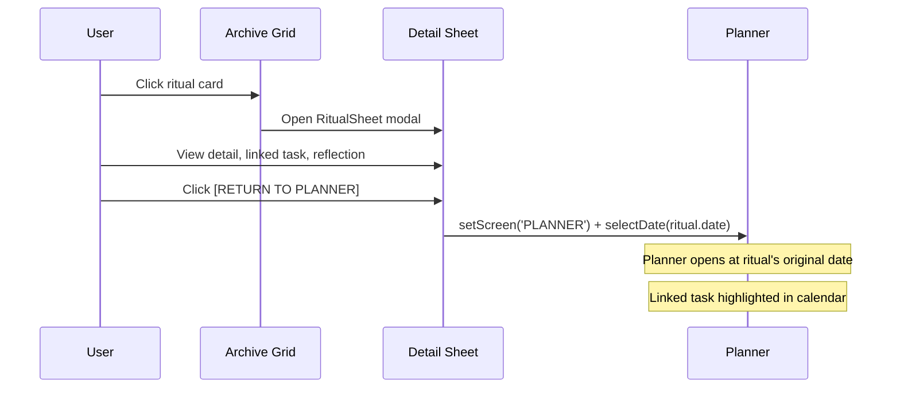

# Tomato V10 — Redesign Specification

> **Night × Imperial Ritual Interface — Media-Art Edition**
> 냉정하고 세심한 Senior PM + Interactive Art Director의 시선으로 작성된 리디자인 명세.

---

## 1. 현재 코드베이스 진단

### 두 개의 코드베이스 현황

Tomato에는 **두 개의 parallel codebase**가 존재한다.

| | `src/` (Production) | `ref/` (Reference Prototype) |
|---|---|---|
| **Stack** | Vanilla JS + Three.js + GSAP, ES Modules | React (CDN Babel), 2D Canvas Stage |
| **Architecture** | DOM imperative (`innerHTML`) | React components (JSX) |
| **State** | `state.js` (localStorage persistence) | `useState` hooks |
| **3D** | Three.js + EffectComposer + RenderPixelatedPass | Canvas 2D polygon stage |
| **UI Structure** | Split-pane Planner, Calendar grid, Archive vault | Sidebar + Main layout, Hour-row timeline |
| **Styling** | Pixel fonts (NeoDunggeunmo, Pixelify Sans, VT323) | Silkscreen + JetBrains Mono + Inter |

### 잘된 점 — 유지 필수

1. **`ref/styles.css` 디자인 시스템** — 가장 완성도 높음
   - CSS variable 체계 (`--deep-base`, `--hero-red`, `--hairline` 등)가 정교함
   - 타이포그래피 계층 (pixel / mono / sans) 이 명확
   - `.hero-card`, `.rcard` (archive card), `.sheet` (detail sheet), `.block` (focus slot)의 디자인 퀄리티가 production-grade
   - Responsive breakpoint (1080/820/640)이 합리적

2. **Archive Detail Sheet (`ref/`)** — 현재 가장 강한 컴포넌트
   - `sheet → sheet-head → s-title → dl → ref → s-actions` 구조
   - 좌측 red border quote box (`.ref`)
   - Ritual ID / Duration / Linked Task / Sequence 메타 구조
   - "RETURN TO PLANNER" CTA 존재 → context flow 인식

3. **Focus Overlay (`ref/`)** — 몰입 구조
   - 전체 화면 takeover (`position: fixed; inset: 0`)
   - 대형 타이머 + PolyOutline 배경 + progress bar 구조
   - "echo/clean/heavy" clock style 변형

4. **`src/three-scene.js`** — 3D background stage
   - Pixel-quantized icosahedron monolith
   - Mode-reactive state transition (home/focus/break/calendar/archive)
   - GSAP-driven smooth transitions
   - Horizon grid + '+' symbol particles

5. **`src/state.js`** — 견고한 상태 관리
   - localStorage persistence, day rollover, safe loading
   - Task/History/Session 분리
   - Calendar offset 관리

### 유지해야 할 핵심 — 건드리지 말 것

> [!CAUTION]
> 아래 요소들은 Tomato의 정체성 그 자체다. 리디자인에서 절대 제거하거나 방향을 바꾸지 말 것.

| 요소 | 이유 |
|---|---|
| Color system 5-token (`#000F08`, `#050505`, `#0F0F0F`, `#FB3640`, `#F4F1EA`) | Night × Imperial 정체성의 뿌리 |
| `[ BRACKET ]` command language | Ritual trigger로서의 pixel command 감성 |
| Pixel font hierarchy (Silkscreen, JetBrains Mono, Inter) | HUD 가독성 + 미디어아트 톤 결정 |
| Corner markers (`.tl`, `.tr`, `.bl`, `.br`) | Hero card의 museum-label 느낌 |
| PolyOutline SVG | 공간감의 핵심 장치 |
| Red accent = signal / active / energy 원칙 | Red overflow 방지의 핵심 규칙 |
| Archive card → detail sheet flow | Archive 정체성의 핵심 interaction |

### Prototype 수준으로 남아 있는 부분

1. **`src/main.js` — Planner rendering**
   - `innerHTML` 기반 imperative DOM 조작 → 유지보수 한계
   - `renderRightPane()` 에서 section visibility 관리가 불안정
   - AI task generation이 fake/hardcoded

2. **`src/ui-controller.js` — 과거 architecture의 잔해**
   - GSAP-based sheet/modal 시스템이 `main.js`와 중복
   - `state.js`에서 `t()` 함수 import하지만 `state.js`에 실제로 없음 → **broken import**
   - AI slice 기능이 `ui-controller.js`에만 있고 `main.js`와 연결 안 됨

3. **Home 화면 (`src/`)** — 최소 기능만 구현
   - Hero block은 task title + pomo dots 만 표시
   - Signal report 제한적
   - `ref/`의 hero-card 수준과 비교하면 크게 부족

4. **Mobile responsive (`src/style.css`)** — 부분적
   - Planner split → column 전환은 있으나 detail 부족
   - Focus controls stacking이 불안정

5. **Calendar nav bug** — 우선 수정 필수
   - `cal-prev`/`cal-next` 버튼이 `renderPlanner()` 내부에서 매번 rebind됨
   - `btnPrev.style.visibility = 'visible'`을 명시적으로 하고 있지만, 실제로 `renderAll()` 호출 시 DOM이 재구성되면서 이벤트 바인딩이 불안정

### 기능적으로 다시 정리해야 할 부분

| 영역 | 문제 | 방향 |
|---|---|---|
| `src/` vs `ref/` 이중 코드 | 두 codebase가 분산되어 있어 어디가 production인지 혼란 | `ref/` 디자인을 `src/`에 통합하는 방향으로 단일화 |
| AI flow | 별도 모달(`ai-prompt-modal`) + 별도 섹션(`ai-output-section`) → 분리됨 | task add/edit flow 내부에 inline으로 통합 |
| Archive event binding | `archiveGallery.addEventListener('click')` 이벤트 delegation은 좋으나, history ID 생성이 side-effect (read 중 mutation) | Archive render 시 ID를 미리 생성하여 순수 렌더링 유지 |
| i18n | `main.js`에 직접 구현, `ui-controller.js`에서도 별도 구현 → 중복 | 단일 i18n module로 통합 |

---

## 2. 리디자인 전략

### MAINTAIN (유지)

- Home hero-card 구조: header → clock → task → CTA
- Archive card grid + detail sheet flow
- Focus overlay 전체 화면 takeover
- Color system 5-token 원칙
- `[ BRACKET ]` command language 전체
- Three.js 3D background stage (mode-reactive)
- Pixel HUD typography 3-tier

### STRENGTHEN (강화)

| 대상 | 현재 | 강화 방향 |
|---|---|---|
| Home hero | 시계 + task 정보만 | stat bar, streak inline, next-up preview 추가 |
| Archive Detail Sheet | 기본 dl + quote | Signal intensity viz, linked planner slot, replay CTA |
| Focus Stage | Timer + 3 buttons | Ambient stage reaction, progress segments, pulse rhythm |
| Planner right pane | AI / TODO / DONE tabs | 통합 flow: Selected context → Task detail → AI inline |
| 3D background | 모든 mode에 동일한 stage | mode별 distinct visual signature (color, speed, particle density) |

### SIMPLIFY (단순화)

- `ui-controller.js` 제거 → `main.js`로 통합 (또는 더 깔끔한 architecture 선택)
- AI prompt modal 제거 → task add/edit 내 inline section으로
- AI loading overlay 제거 → inline thinking state
- `ref/` 별도 유지하되, production에서 참조하지 않는 dead code

### RESTRUCTURE (재구성)



### 우선순위

```
P0 FIX   Calendar nav bug, broken imports
P1 HOME  Hero card upgrade + right column refinement
P1 PLAN  Planner right pane restructure + task→start flow
P2 ARCH  Archive detail sheet premium enhancement
P2 FOCUS Focus stage media-art immersion
P3 R3F   Background stage mode-specific reactions
P3 MOB   Mobile responsive polish
```

---

## 3. Home 재정의

### 기본 구조 — 유지

```
┌─────────────────────────────────────────┐
│ hero-card                               │ right-col (panels)
│ ┌─ hero-head (signal + tag)            │ ┌─ FOCUS SLOTS / TODAY
│ │                                      │ │  timeline rows
│ ├─ hero-clock-wrap                     │ ├─ SIGNAL STATS
│ │  [PolyOutline background]           │ │  stat-grid + streak
│ │  [big-clock  MM:SS]                 │ ├─ RECENT RITUALS
│ │  [status sub-label]                  │ │  mini-ritual strip
│ ├─ hero-task (tonight's focus)         │ └─
│ ├─ hero-cta (BEGIN / ENTER STAGE)      │
└─────────────────────────────────────────┘
```

### 업그레이드 포인트

#### 3-1. Hero Card 강화

- **Signal Status Bar** 추가 (hero-head 아래):
  ```
  ▏▏▏▏▏▏▏▏▏▏▎▕ ░░░░  — 3/4 BLOCKS COMPLETE · STREAK 6D
  ```
  가로 바 형태. 좌측 hero-red filled / 우측 hairline empty. 14 streak dots 대신 바로 hero 영역에 inline.

- **Hero Clock 반응**:
  - `idle` → 점멸 colon (현재 유지)
  - `running` → hero-red text-shadow 강화 + PolyOutline node 미세 glow
  - `paused` → dim 처리 + colon 정지

- **Hero Task 영역 확장**:
  ```
  TONIGHT'S MAIN FOCUS                    NEXT →
  DEEP SYSTEM DESIGN                      23:00
  25 MIN RITUAL · 3 BLOCKS QUEUED         발표 구조 정리
  ```
  NEXT 옆에 다음 task 제목도 표시.

#### 3-2. Right Column 정리

- **FOCUS SLOTS** 패널: 현재 `today-row` 유지. active row에 `▶` glyph 추가.
- **SIGNAL STATS** 패널: stat-grid 4칸 유지. `.accent` stat에만 red glow. streak dots → bar로 교체 (밀도 향상).
- **RECENT RITUALS** 패널: `.mini-ritual` card 가로 스크롤 유지. card 개수 → 최근 4개로 제한 (화면 밀도 적정).

#### 3-3. R3F / Media-Art 허용 범위

| 허용 | 불허 |
|---|---|
| PolyOutline node glow on running state | Hero card 자체를 3D 오브젝트로 |
| Background 3D monolith subtle rotation | Hero 위에 particle overlay |
| Hero card `::before` gradient line 연출 | 3D 인터랙티브 버튼 |
| Vignette / scanline / grain 유지 | 전체 화면 WebGL takeover |

#### 3-4. Hero가 더 강하게 보이기 위한 규칙

1. **Hero card는 화면의 단일 주인공** — right-col은 정보 보조역. hero의 시각적 무게가 항상 60% 이상.
2. **Clock size는 `clamp(72px, 10vw, 140px)` 유지** — 모바일에서도 화면 지배력 보장.
3. **Hero-red glow는 running 상태에서만** — idle 시에는 red 최소화하여 "시작 대기" 긴장감.
4. **CTA button 계층 명확**: `BEGIN RITUAL` = primary hero-red fill. `ENTER STAGE` = ghost border only.

---

## 4. Planner 재정의

### 4-1. 전체 구조 — 좌우 Split

```
┌──────────────────────┬─────────────────────────┐
│ LEFT: Calendar View  │ RIGHT: Planning Console  │
│                      │                          │
│ [ < ] 2026. 04 [ > ] │ ┌── SELECTED DATE ──────┐│
│                      │ │ 2026-04-21 // MON      ││
│ SUN MON TUE...       │ ├── TASK DETAIL ─────────┤│
│ ┌──┬──┬──┬──┬──┬──┬──│ │ #F_t1 // 25m RITUAL   ││
│ │  │  │  │  │  │  │  │ │ DEEP SYSTEM DESIGN    ││
│ │  │  │  │  │  │  │  │ │ [BEGIN RITUAL] [EDIT]  ││
│ │  │  │  │  │  │23│  │ ├── SCHEDULED ───────────┤│
│ │  │  │  │  │  │  │  │ │ 22:00 DESIGN    25m   ││
│ │  │  │  │  │  │  │  │ │ 23:00 REVIEW    25m   ││
│ │  │  │  │  │  │  │  │ ├── UNSCHEDULED ─────────┤│
│ │  │  │  │  │  │  │  │ │ 슬라이드 초안   50m   ││
│ │  │  │  │  │  │  │  │ ├── AI PLAN OUTPUT ──────┤│
│ └──┴──┴──┴──┴──┴──┴──│ │ (when AI applied)      ││
│                      │ └────────────────────────┘│
└──────────────────────┴─────────────────────────┘
```

### 4-2. Right Pane Sections

**Section 구성 (위→아래, 조건부 표시)**:

1. **SELECTED DATE** — 항상 표시. 선택된 날짜 + 요일. 오늘이면 hero-red.
2. **TASK DETAIL** — task 선택 시에만 표시. 상세 정보 + `[BEGIN RITUAL]` + `[EDIT]` 버튼.
3. **SCHEDULED** — 선택된 날짜의 scheduled tasks 리스트. 시간순 정렬.
4. **UNSCHEDULED** — targetDate가 없는 open tasks. drag-to-schedule 가능.
5. **AI PLAN OUTPUT** — AI 생성 결과가 있을 때만 표시. `[APPLY]` / `[REGENERATE]` CTA.

### 4-3. 날짜 → Task → Slot → 시작 연결 구조



### 4-4. 캘린더 Task 클릭 시 상세 + 즉시 시작

**현재 문제**: cal-task-item 클릭 → `showTaskDetail()` → right pane에 detail 표시까지는 됨. 하지만:
- Detail card에 `[BEGIN RITUAL]` 이 `canStart` 조건 (open/active) 에서만 보임 → OK
- `[BEGIN RITUAL]` 클릭 시 task.status를 active로 바꾸고, 500ms 후 focus view 전환 → **개선 필요**

**개선안**:
- Task item 클릭 시 right pane에 **즉각적으로** detail 표시 (현재 로직 유지)
- Calendar cell 내 task item에도 micro-indicator 추가: `▶` (active), `✓` (done), `—` (missed)
- `[BEGIN RITUAL]` 클릭 시:
  1. `triggerRitualManeuver()` 3D 전환 동시 실행
  2. 300ms delay로 focus view 전환 (500ms → 300ms 단축)
  3. Task card에 brief "INITIATING..." flash state (100ms)

### 4-5. Month Navigation — 절대 깨지지 않는 구조

**Root Cause**: `renderPlanner()` 가 calendar grid를 매번 rebuild하면서 `bindPlannerEvents()` 를 호출. 하지만 `cal-prev`/`cal-next` 버튼은 grid 외부에 있으면서도 매번 rebind됨.

**Fix 규칙**:
```javascript
// Navigation buttons는 init() 에서 한 번만 bind.
// renderPlanner()에서는 grid cells만 rebuild.
function initPlannerNav() {
  const btnPrev = document.getElementById('cal-prev');
  const btnNext = document.getElementById('cal-next');
  
  // 한 번만 bind — 절대 rebind 하지 않음
  btnPrev.addEventListener('click', () => {
    appState.session.calendarOffset--;
    saveSession();
    renderPlanner(); // renderAll() 아님 — 불필요한 home/archive re-render 방지
  });
  
  btnNext.addEventListener('click', () => {
    appState.session.calendarOffset++;
    saveSession();
    renderPlanner();
  });
}
```

**UI 규칙**:
- `[ < ]` / `[ > ]` 버튼은 **항상 visible**, 절대 hidden/display:none 하지 않음
- 버튼에 disabled state 없음 — 무한 과거/미래 탐색 허용
- 현재 월로 돌아오는 `[ TODAY ]` 버튼 추가 (중앙)

### 4-6. AI 세분화 Flow — Task Add/Edit 내부 통합

**현재 구조 (문제)**:
```
AI PROMPT MODAL (별도 전체화면) → AI LOADING → ai-output-section (right pane)
```

**개선 구조**:
```
EDIT MODAL 내부 → [AI SUBDIVIDE] 클릭
  → modal 내 ai-subdivide-section 확장 (현재 이미 존재)
  → inline loading state (버튼 text → "CURATING...")  
  → subdivision blocks 표시
  → [APPLY BLOCKS] / [REGENERATE] / [EDIT INDIVIDUAL]
```

이미 `index.html`에 `ai-subdivide-section`이 edit modal 내부에 있음 → 이 구조를 살림.
별도 `ai-prompt-modal`은 deprecated → 제거하거나 숨김.

**Apply / Edit / Regenerate Flow**:


### 4-7. 모바일 적응

```css
@media (max-width: 768px) {
  .planner-split {
    flex-direction: column;
    height: auto;
  }
  .left-pane {
    flex: none;
    height: 50vh;
    overflow-y: auto;
  }
  .right-pane {
    flex: none;
    min-height: 40vh;
    /* Selected date + task detail을 compact mode로 */
  }
}
```

- Calendar cell `min-height: 70px` (80 → 70)
- Task item font `0.6rem` 유지
- Right pane sections: 접힌 상태 기본, 선택 시 expand

---

## 5. Archive 재정의

### 5-1. Detail Sheet 강점 유지 + Premium 강화

**현재 강점 (`ref/` RitualSheet)**:
- Sheet backdrop (blur 6px)
- Red accent line (`::before`)
- Ritual ID display
- `dl` 기반 메타 구조 (DATE, DURATION, LINKED TASK, SEQUENCE, STATUS)
- Reference quote box (`.ref`)
- RETURN TO PLANNER CTA

**강화 포인트**:

```
┌─ RITUAL MEMORY VAULT ──────────────────────┐
│                                             │
│  RITUAL ID: R-024            [ CLOSE ]      │
│  ─────────────────────────────────────      │
│                                             │
│  ██ DEEP SYSTEM DESIGN ██                   │
│                                             │
│  DATE        2026.04.20 / 22:00             │
│  DURATION    ██ 25 MIN ██                   │
│  LINKED TASK System architecture refinement  │
│  SEQUENCE    3rd ritual tonight              │
│  PLANNER     2026.04.20 / 22:00 slot        │ ← NEW
│  STATUS      ██ COMPLETED ██                │
│                                             │
│  ┌─ SIGNAL INTENSITY ─────────────────── │ ← NEW
│  │ ▓▓▓▓▓▓▓▓▓▓▓▓▒▒░░  82% STEADY         │
│  └──────────────────────────────────────── │
│                                             │
│  "Signal remained stable through            │
│   completion."                              │
│                                             │
│  ┌─ SYSTEM REFLECTION ───────────────── │ ← NEW
│  │ Deep cadence achieved. Clear next-step   │
│  │ identified. No interrupts logged.        │
│  └──────────────────────────────────────── │
│                                             │
│  [ RETURN TO PLANNER ]  [ RE-EXECUTE ]      │ ← RE-EXECUTE = NEW
│  [ CLOSE ]                                  │
└─────────────────────────────────────────────┘
```

**NEW 요소들**:

1. **PLANNER SLOT** — linked planner date/time slot 표시. 클릭 시 해당 날짜 planner로 이동.
2. **SIGNAL INTENSITY** — 가짜 progress bar (완료된 시간/전체 시간 비율). 시각적 ritual의 "강도"를 표현.
3. **SYSTEM REFLECTION** — `systemNote` 필드 확장. 2-3줄의 system-generated reflection. 기존 note 보다 더 풍성한 narrative.
4. **RE-EXECUTE** — 동일한 task를 다시 실행하는 shortcut. 새 task 생성 → focus stage 진입.

### 5-2. Archive를 다시 열어보게 만드는 동기

- **Ritual streak visualization** — 상단 stat bar에 연속 기록 시각화.
- **Card identity** — 각 card마다:
  - Symbol (`■`, `▲`, `●`, `◆`, `▼`, `◐`, `□`)은 task category에 따라 자동 배정
  - Color (red / white / dark) 는 ritual intensity에 따라 결정
    - 25min = dark
    - 50min = white
    - Active/deep sessions = red
  - 이 조합이 각 ritual의 "수집용 identity"가 됨

- **Date group header 강화**:
  ```
  2026.04.20 — 4 RITUALS // 100 MIN FOCUSED // STREAK DAY 6
  ```

- **Empty card ("NEXT RITUAL")** — 다음 ritual 시작으로의 shortcut. 클릭 시 home으로 이동.

### 5-3. Card → Detail → Planner 복귀 흐름



### 5-4. 기록마다의 Identity System

| 속성 | 결정 기준 |
|---|---|
| Symbol | Task title의 첫 글자 hash → symbol pool에서 선택 |
| Card color | Duration + completion quality |
| Rotation (aesthetic) | Sequence number mod 3 → -4deg / 0deg / 3deg |
| Glow | Hero-red glow on hover for red cards only |

### 5-5. 보여줘야 할 메타 정보

| 정보 | 위치 | 표현 방식 |
|---|---|---|
| System reflection | Detail sheet — quote box | Italic mono text, red left border |
| Linked task | Detail sheet — dl row | Plain text, clickable → task in planner |
| Linked planner slot | Detail sheet — dl row | Date + time, clickable → planner nav |
| Sequence position | Detail sheet — dl row | "3rd ritual tonight" |
| Signal intensity | Detail sheet — bar visualization | Filled bar + percentage |

### 5-6. Memory Vault 느낌을 주는 방법

1. **진입 애니메이션**: card 클릭 시 sheet가 `scale 0.96 → 1.0` + `y: 20px → 0` (300ms ease-out)
2. **Sheet 상단 red line**: `height: 2px; background: hero-red; box-shadow: 0 0 10px rgba(251,54,64,0.5)`
3. **Ritual ID 표시 스타일**: `letter-spacing: 0.3em; color: hero-red;` — 마치 archive document ID
4. **System Note**: handwritten/log 느낌의 mono italic
5. **Background**: `rgba(0,15,8,0.94)` backdrop → 전시 공간 진입 느낌

---

## 6. Focus / Timer 재정의

### 6-1. 더 Immersive하게 만드는 방법

**현재 구조** (유지):
```
fixed overlay → radial-gradient background
  → fs-poly (PolyOutline 80vmin backdrop)
  → fs-inner (label + clock + linked + actions)
  → fs-ticks + fs-progress (bottom)
```

**강화 요소**:

1. **Phase-based ambient shift** — 남은 시간에 따라 background radial gradient 변화:
   - 75-100%: Deep base, calm
   - 50-75%: Subtle red tint increase
   - 25-50%: Stronger red glow center
   - 0-25%: "Tension mode" — faster PolyOutline rotation, pulsing progress bar

2. **PolyOutline 반응**:
   - Running → node glow (box-shadow on rect), slow rotation
   - 3min 남음 → polygon stroke color → hero-red, faster rotation
   - Complete → all nodes flash white simultaneously (300ms)

3. **Progress bar 개선**:
   - 시간 tick mark를 top에 유지 (현재 `fs-ticks`)
   - Progress bar에 **segment marks** 추가: 5분 단위 구분선
   - Fill에 `box-shadow: 0 0 10px hero-red` 유지 + `transition: width 0.2s linear`

### 6-2. 시계 가독성과 Pixel 감성의 균형

**규칙**:
- Clock font: Silkscreen 유지 — pixel 감성의 핵심
- Size: `clamp(110px, 18vw, 240px)` — 모바일에서도 최소 110px
- Text-shadow: 3-tier ("echo" / "clean" / "heavy") 유지
  - `echo` (default): `6px 6px 0 hero-red, -2px 0 0 hero-red-deep`
  - `clean`: shadow 없음
  - `heavy`: shadow 강화 + ambient glow
- Colon: `pulse 1.2s steps(2) infinite` 유지 — running 상태에서만

### 6-3. R3F 참고 요소 반영

| 요소 | Focus에서의 적용 |
|---|---|
| Background polygon/particle | PolyOutline rotation + Canvas 2D particle drift (stage.js 활용) |
| Focus depth | Background blur 깊이감 (backdrop-filter: blur(3px) → 진행 중 점진적 증가) |
| Pulse rhythm | Hero-red radial gradient pulse — `sin(t)` 기반, 2초 주기 |
| Camera drift | N/A (2D UI이므로) — 대신 PolyOutline 미세 oscillation으로 대체 |

### 6-4. 상태별 감각적 표현

| 상태 | 시각 | 청각 (future) | 3D Stage |
|---|---|---|---|
| **Running** | Red glow, pulsing colon, steady progress | — | Monolith scale 1.2, wire red, signal opacity 0.3 |
| **Paused** | Dim white, "// PAUSED //" label, progress 정지 | — | Monolith frozen, wire dim |
| **Tension** (< 3min) | Text-shadow intensified, status "FINAL STRETCH", faster pulse | — | Grid speed 5x, signal opacity 0.5 |
| **Complete** | Flash white → fade to break/home | — | triggerRitualManeuver() |

### 6-5. Foreground Readability 보호

> [!IMPORTANT]
> Focus stage에서 시계와 CTA 버튼의 가독성은 **절대 타협 불가**.

- Clock z-index: 2 (background 위)
- fs-inner background: transparent (no additional overlay)
- Button contrast: `btn-primary` → hero-red fill. `btn-ghost` → white border. 모두 `font-size: 13px` 이상.
- Progress bar: 화면 하단 10% 영역에 고정. label 겹침 없음.
- PolyOutline opacity: 최대 `0.2` — 시계 위에서 읽기를 방해하지 않음.

---

## 7. R3F 참고 방향

### 7-1. "참고만" 하는 원칙

Tomato는 **2D foreground UI + 3D background atmosphere** 구조다.
R3F의 인터랙티브/공간감/반응형 연출을 참고하되, **번역하여 적용**한다.

| R3F 원본 | Tomato 번역 |
|---|---|
| Three.js scene with camera orbit | Canvas 2D stage with slow polygon rotation |
| React-three-fiber components | Vanilla JS Three.js (현재 `three-scene.js`) |
| 3D interactive objects | Background wireframe monolith (non-interactive) |
| Post-processing bloom/glitch | RenderPixelatedPass + scanline overlay |
| Real-time physics | CSS animation + GSAP easing |

### 7-2. 제한적 사용 지점

| 위치 | 적용 | 강도 |
|---|---|---|
| **Background stage (모든 화면)** | Monolith + grid + particles | Always on, mode-reactive |
| **Focus stage background** | Enhanced red glow pulse, faster grid | High during focus |
| **Home hero-card PolyOutline** | SVG polygon + node glow | Subtle, decorative |
| **Archive card hover** | CSS transform only — no 3D | Minimal |
| **Planner** | Monolith shrinks, grid slows | Reduced to near-invisible |

### 7-3. 절대 가져오면 안 되는 요소

> [!WARNING]
> - UI 요소를 3D 공간에 배치하지 말 것 (text in 3D, 3D buttons)
> - Foreground에 WebGL canvas를 overlay하지 말 것
> - 마우스 따라 전체 camera 이동하지 말 것 (focus mode에서 이미 차단)
> - GPU-intensive particle system (> 500 particles)
> - Bloom post-processing (성능 + 가독성 파괴)
> - 3D transition between screens (page는 2D DOM transition)

### 7-4. 적절한 미디어아트 표현

| 표현 | 적절성 | 이유 |
|---|---|---|
| Slow wireframe rotation | ✅ | 공간감, 명상적 |
| Pixel-quantized vertices | ✅ | HUD 감성과 일치 |
| Radial glow pulse | ✅ | Focus energy 시각화 |
| Grid drift | ✅ | Depth perception |
| Particle field (sparse, '+' symbol) | ✅ | 설치물 atmosphere |
| Color shift per mode | ✅ | Context-aware environment |
| Scanline + grain overlay | ✅ | Texture, premium feel |
| Vignette | ✅ | Exhibition space framing |

### 7-5. 구현 난이도 대비 효과적인 적용 포인트

| 포인트 | 난이도 | 효과 | 우선순위 |
|---|---|---|---|
| Mode-reactive monolith color/speed | Low (이미 구현) | High | P1 |
| PolyOutline node glow on running | Low (CSS) | Medium | P2 |
| Focus stage gradient phase shift | Low (CSS variable) | High | P2 |
| Scanline/grain intensity per mode | Low (opacity CSS var) | Medium | P3 |
| Particle density per mode | Medium (JS) | Medium | P3 |

---

## 8. 인터랙티브 디자인 규칙

### 8-1. 상태별 시각 반응

| State | Border | Background | Text | Glow | Additional |
|---|---|---|---|---|---|
| **Hover** | `hairline-2 → hairline-3` | `rgba(255,255,255,0.03)` | `muted → soft-white` | None | Cursor pointer |
| **Tap/Active** | Momentary inset | `transform: translate(1px,1px)` | — | — | Box-shadow removal (tactile) |
| **Selected** | `hero-red` (1px solid) | `rgba(251,54,64,0.06)` | `soft-white` | `inset 0 0 20px rgba(red,0.12)` | Indicator bar left |
| **Active/Running** | `hero-red` (1px solid) | `rgba(251,54,64,0.08)` | `soft-white` | `0 0 22px rgba(red,0.22)` outer | Pulse animation, `▶` indicator |
| **Done** | `transparent` | Transparent | `dim-white`, line-through | None | `opacity: 0.5` |
| **Complete** (archive) | Card bg color | Full card fill | Dark on colored | — | transform rotate |

### 8-2. Task ↔ Calendar Slot Cross-Highlight

```
calendar cell task item click
  → right pane task-detail-section appears
  → calendar cell의 해당 task item에 .highlighted class 추가
  → highlighted = { background: rgba(251,54,64,0.2), border-left: hero-red, box-shadow }
  
right pane scheduled task click
  → 같은 동작
  → 추가: calendar에서 해당 날짜 cell에 selected-cell class 보장
```

### 8-3. Archive Card 반응

```css
.rcard { transition: transform 0.15s, box-shadow 0.15s; }
.rcard:hover { 
  transform: translate(-2px, -2px); 
  box-shadow: 4px 4px 0 currentColor; 
}
.rcard:active { 
  transform: translate(0, 0); 
  box-shadow: none; 
}
```
- Red card hover: `box-shadow: 4px 4px 0 #D92C37`
- White card hover: `box-shadow: 4px 4px 0 #999`
- Dark card hover: `box-shadow: 4px 4px 0 #333`
- Empty card hover: border-color → hero-red, color → hero-red

### 8-4. Command Button — Ritual Trigger 느낌

**규칙**:
1. 모든 command button은 `[ BRACKET ]` syntax 사용
2. Primary action (hero-red fill): 3D box-shadow `3px 3px 0`
3. Hover: `translate(-1px,-1px); box-shadow: 4px 4px 0`
4. Active (pressing): `translate(1px,1px); box-shadow: none` — **physical press 감각**
5. Font: Silkscreen (pixel font) exclusively
6. Letter-spacing: `0.1em` 이상
7. Minimum padding: `8px 14px`

### 8-5. 과하지 않으면서 살아있는 인터랙션 원칙

> **Rule of Restraint**: 한 화면에서 동시에 움직이는 요소는 **최대 2개**.

1. **Background stage**: 항상 미세하게 움직임 (grid drift, monolith rotation) — 이것이 "살아있음"의 기본
2. **Foreground UI**: 기본 정적. hover/click 시에만 반응. 자동 animation은 **colon pulse** 와 **signal dot pulse** 만 허용
3. **Transition**: GSAP `fadeIn 0.3s` 또는 CSS `transition 0.15s` 로 제한. 0.5s 이상 animation 금지 (체감 지연)
4. **No looping animations on foreground** — background only

---

## 9. 비주얼 시스템 정리

### 9-1. Panel 계층

```
z-0  : Background stage (Three.js / Canvas 2D)
z-1  : Texture overlays (vignette, scanlines, grain)
z-2  : App shell (.app grid)
z-10 : Main content (home, planner, archive)
z-40 : Sheets / Modals (ritual detail, edit modal)
z-50 : Focus stage overlay
z-60 : Tweaks panel
z-70 : Command palette
```

### 9-2. Border / Glow / Fill 규칙

| 용도 | 스타일 |
|---|---|
| **Container boundary** | `1px solid var(--hairline-2)` (rgba 255,255,255,0.14) |
| **Section divider** | `1px solid var(--hairline)` (rgba 255,255,255,0.08) |
| **Active highlight** | `1px solid var(--hero-red)` |
| **Empty/available** | `1px dashed var(--hairline-2)` |
| **Active glow** | `box-shadow: 0 0 0 1px rgba(red,0.2)` (inner) + `0 0 22px rgba(red,0.22)` (outer) |
| **Hero card top line** | `height: 1px; background: linear-gradient(90deg, transparent, hero-red, transparent)` |
| **Sheet top line** | `height: 2px; background: hero-red` |

### 9-3. Hero Red 사용 원칙

> [!IMPORTANT]
> Hero Red (#FB3640) 는 **신호 / 활성 / 에너지** 전용이다.

| 허용 | 불허 |
|---|---|
| Active state indicator | Background fill for large areas |
| CTA button fill (primary only) | Body text color |
| Duration/time metadata | Decorative accents without meaning |
| Signal dot / pulse | Multiple simultaneous red glows |
| Progress bar fill | Red borders on non-active containers |
| Streak highlight | |
| Sheet top accent line | |

**Red Budget Rule**: 한 화면에서 hero-red가 차지하는 면적은 **전체의 5% 이하**.

### 9-4. Typography Hierarchy

```
TIER 1 — Pixel Display
  Font: Silkscreen
  Usage: Clock, card titles, CTA labels, section headers
  Sizes: 9px (micro) / 11-14px (body) / 24-36px (display) / 72-240px (clock)
  Letter-spacing: 0.04em — 0.15em
  
TIER 2 — Mono Functional  
  Font: JetBrains Mono
  Usage: Timestamps, metadata, navigation, input, body content
  Sizes: 9px (micro label) / 10-11px (meta) / 12-14px (body)
  Letter-spacing: 0.04em — 0.3em (labels only)

TIER 3 — Sans Readable
  Font: Inter
  Usage: Long-form text (if any), system messages
  Sizes: 12-14px
  Weight: 300-500
```

### 9-5. Pixel HUD와 Functional UI의 관계

```
┌─ Pixel HUD (atmospheric) ──────────────────┐
│ Section titles, CTA labels, stats values    │
│ → "이것은 시스템 인터페이스다" 라는 인상      │ 
│ → 전시물의 라벨, 모니터링 콘솔의 표시장치      │
└─────────────────────────────────────────────┘

┌─ Functional UI (readable) ─────────────────┐
│ Task names, timestamps, input fields        │
│ → "이것은 실제 사용 가능한 도구다" 라는 인상   │
│ → 빠르게 읽고 조작할 수 있어야 함              │
└─────────────────────────────────────────────┘

Rule: Pixel = 감성 / Mono = 기능. 두 개를 섞지 않는다.
       Clock, title, label → Pixel.
       Time, meta, content → Mono.
```

### 9-6. 3D Background와 Foreground UI의 거리감

- Background Three.js canvas: `z-index: 0`, `pointer-events: none`
- Vignette + grain: `z-index: 1` — background와 foreground 사이의 "공기층"
- Foreground UI: `z-index: 2+`, backdrop-filter blur로 depth 분리
- **Sidebar**: `backdrop-filter: blur(10px)` — 반투명 패널로 background 위에 떠있는 느낌
- **Hero card**: `radial-gradient` 배경으로 자체 깊이감
- **Focus overlay**: `backdrop-filter: blur(3px)` — 모든 것 위에 올라옴

### 9-7. Spacing Rhythm / Density / Negative Space

```
Macro spacing (section gaps):     20px — 24px
Panel internal padding:           16px — 18px (compact) / 28px — 32px (spacious hero)
Row gap in lists:                 4px — 6px
Element internal padding:         8px — 14px
Micro spacing (text-to-border):   2px — 4px

Density rule:
- Home: MEDIUM density — hero 여유 + right-col compact
- Planner: HIGH density — 정보량 우선, 최소 여백
- Archive: MEDIUM-LOW density — 카드 사이 negative space 넉넉히
- Focus: VERY LOW density — 시계만 보이는 극도의 미니멀

Negative space rule:
- Hero card 내부: 시계 주변 최소 20px padding
- Archive grid gap: 14px (카드 사이 숨쉴 공간)
- Focus clock: 화면 중앙, 상하 40% 영역 독점
```

---

## 10. 실제 리디자인/개발 우선순위

### Phase 1 — Foundation Fix (즉시)

> 지금 깨져 있는 것을 고치고, 핵심 flow를 연결한다.

| 항목 | 상세 |
|---|---|
| **Calendar nav bug fix** | `initPlannerNav()`로 분리, init()에서 한 번만 bind |
| **Broken import fix** | `ui-controller.js`의 `t()` import 경로 수정 또는 module 통합 |
| **Task → Start flow 연결** | Calendar task click → detail → BEGIN RITUAL → focus 전환 확인 |
| **`ref/styles.css` → `src/style.css` 통합** | ref의 design token과 component style을 src로 이식 |
| **AI flow inline 통합** | 별도 modal 제거 → edit modal 내 ai-subdivide-section 활성화 |

**예상 작업량**: 2-3일

### Phase 2 — Screen Upgrade (다음)

> 각 화면의 디자인 퀄리티를 ref/ 수준으로 올린다.

| 항목 | 상세 |
|---|---|
| **Home hero card → ref/ 수준** | Signal status bar, streak inline, clock variation |
| **Planner right pane restructure** | 5-section structure, 조건부 표시, AI inline |
| **Archive detail sheet premium화** | Signal intensity bar, system reflection, planner link |
| **Focus stage ambient phase** | Time-based gradient shift, PolyOutline reaction |
| **Typography unification** | Silkscreen + JetBrains Mono 전환 (NeoDunggeunmo → deprecate) |

**예상 작업량**: 5-7일

### Phase 3 — Polish & Atmosphere (나중)

> 미디어아트 atmosphere를 올리고, responsive를 마무리한다.

| 항목 | 상세 |
|---|---|
| **3D stage mode-specific reactions 강화** | Archive mode monolith distant, planner mode subtle |
| **Scanline/grain intensity per mode** | CSS custom property로 mode별 조절 |
| **Mobile responsive 완성** | 640px breakpoint 세밀화, touch gesture 고려 |
| **Command palette 확장** | 더 많은 command, fuzzy search |
| **Tweaks panel 확장** | Clock style + stage intensity + accent color |
| **Performance audit** | Three.js draw calls, DOM paint 최적화 |

**예상 작업량**: 3-5일

---

## 11. 결과물 요약

### 전체 리디자인 방향

Tomato를 **"media-art ritual interface"** 로 한 단계 끌어올리되, 기능적 명확성을 절대 희생하지 않는다.
- Home은 **performative ritual entry** — 시작의 의식감
- Planner는 **tactical planning workspace** — 효율적 배치
- Focus는 **immersive execution stage** — 몰입형 집중
- Archive는 **collectible ritual memory vault** — 수집의 보상감

### Screen-by-Screen 전략 요약

| Screen | 전략 | 핵심 변화 |
|---|---|---|
| **Home** | 유지 + 강화 | Hero status bar, next-up, clock reaction |
| **Planner** | 재구성 | Right pane 5-section, AI inline, nav fix |
| **Archive** | 강화 | Detail sheet premium, signal intensity, planner link |
| **Focus** | 강화 | Phase-based ambient, PolyOutline reaction, progress segments |

### Visual Refinement Rules (요약)

1. Red budget ≤ 5% per screen
2. Moving elements ≤ 2 per screen (foreground)
3. Pixel = emotion, Mono = function
4. All commands in `[ BRACKET ]` syntax
5. Depth via backdrop-filter, not z-fighting
6. Container = `hairline-2` border, Active = `hero-red` border
7. Press feedback: `translate(1px,1px) + shadow removal`

### R3F-Inspired Usage Rules (요약)

1. Background only — never foreground
2. Mode-reactive — not decorative
3. Performance ≤ 500 particles, ≤ 2 draw calls for stage
4. PolyOutline = primary spatial device
5. Monolith = ambient presence, not interactive
6. No bloom, no postprocessing beyond pixel pass
7. 60fps mobile target

### Implementation Guidance

**Architecture decision**: 현재 `src/` (Vanilla JS + Three.js)를 기반으로 진행. `ref/` (React)는 **디자인 사양서로만 참고**. `ref/styles.css`의 CSS를 `src/style.css`로 이식. `ref/app.jsx`의 컴포넌트 구조를 vanilla JS render 함수로 번역.

**CSS migration**:
```
ref/styles.css (1147 lines, production-grade design tokens)
  → src/style.css (293 lines, 기존)
  → merged src/style.css (~1000 lines, ref 기반 + src 유지분)
```

**JS consolidation**:
```
src/ui-controller.js (471 lines, partially broken)
  → 필요 기능을 src/main.js로 흡수
  → ui-controller.js 제거 또는 빈 파일로
```
